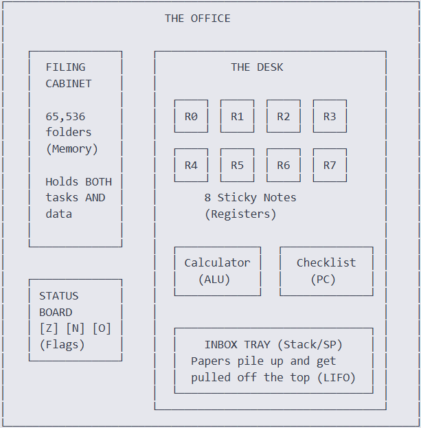
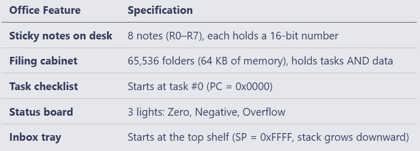

# 16-Bit CPU Scratch in C

This document explains how the CPU emulator works using a simple office analogy. The goal is to keep the language clear and easy to understand.

---

## Office Analogy
Think of one office worker at a desk. That worker is the CPU. Everything about the CPU maps to this office.

  


- The worker can only calculate with papers that are already on the desk. These papers are the **registers**.
- If the worker needs data from the filing cabinet (the **memory**), they must walk over, fetch the folder, and bring it back. Registers are the fast workspace to avoid that trip.

---

## What Does the Worker Do?
The worker repeats four simple steps over and over:

1. **Fetch**: Read the next instruction from the checklist.
2. **Decode**: Figure out what the instruction means (e.g. "add sticky note 0 and sticky note 1").
3. **Execute**: Do the work, using a calculator if needed.
4. **Advance**: Move to the next item on the checklist (increment the program counter).

```text

  WORKER'S DAILY ROUTINE                      
                                              
  1. Read next task from checklist  [FETCH]   
                                             
  2. Understand what it says        [DECODE]  
                                             
  3. Do the work                    [EXECUTE] 
                                             
  4. Cross it off, move to next     [ADVANCE] 
                                             
               repeat until "GO HOME" 

```

The loop continues until an instruction tells the worker to "go home"; this is the **HALT** instruction.

---

## CPU Blueprint
Here is a rough diagram of the CPU architecture:



---

## Status Board (Flags)
A small board on the wall shows three lights. After each calculation, the lights update:

- **Z (Zero)**: lit when the result is 0. Used for checks like "is equal?".
- **N (Negative)**: lit when the result is negative (bit 15 set in twos complement).
- **O (Overflow)**: lit when the result wrapped around because it was too large.

These flags help the worker make decisions, especially for conditional jumps.

---

## Inbox Tray (Stack)
A spring-loaded tray on the desk holds sticky notes. It works like this:

- **Push** a note: the tray moves down one slot.
- **Pop** a note: the tray springs up one slot.

This structure is a **stack** (Last In, First Out). Its used for:

1. Saving temporary values.
2. Remembering where to return after a sub-task (function calls).

The stack pointer (SP) starts at 0xFFFF and moves downward on each push, upward on each pop, matching the convention used by real x86 processors.

