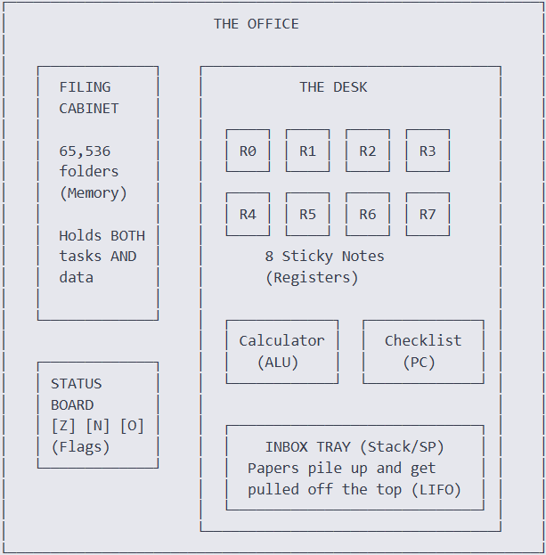
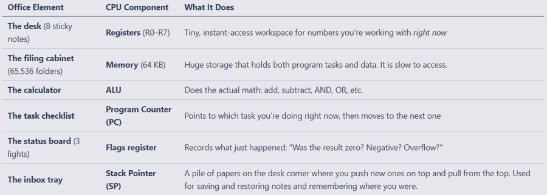
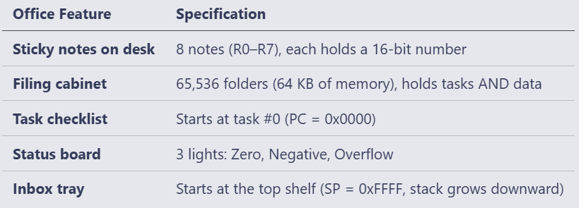

# 16-Bit CPU (From Scratch in C)

This project explains a simple 16-bit CPU emulator using an office analogy.
The goal is to make core CPU ideas easy to understand while still being technically accurate.

## Office Analogy

Imagine one office worker at a desk. That worker is the CPU.




- Papers on the desk are **registers** (fast, immediate workspace).
- The filing cabinet is **memory** (larger, but slower to access).
- The worker prefers desk papers first because they are faster than walking to the cabinet.

## The CPU Cycle (Fetch → Decode → Execute → Advance)

The worker repeats the same 4-step loop:

1. **Fetch**: Read the next instruction.
2. **Decode**: Interpret what the instruction means.
3. **Execute**: Perform the operation.
4. **Advance**: Move to the next instruction (increment the program counter).

```text
WORKER'S DAILY ROUTINE

1) Read next task      [FETCH]
2) Understand task     [DECODE]
3) Perform task        [EXECUTE]
4) Move to next task   [ADVANCE]

Repeat until "GO HOME" (HALT)
```

Execution stops when the CPU encounters the **HALT** instruction.

## CPU Blueprint

High-level architecture diagram:



## Flags (Status Board)

After arithmetic/logic operations, status flags are updated:

- **Z (Zero)**: set when result is `0`.
- **N (Negative)**: set when result is negative (bit 15 set in two's complement).
- **O (Overflow)**: set when signed arithmetic overflows.

These flags are mainly used by conditional jump instructions.

## Stack (Inbox Tray)

The stack is a Last-In, First-Out (LIFO) structure:

- **Push**: add value, stack grows downward.
- **Pop**: remove value, stack moves upward.

Typical uses:

1. Save temporary values.
2. Store return addresses for function calls.

The stack pointer (**SP**) starts at `0xFFFF`, decreases on push, and increases on pop.

## Instruction Encoding (16-bit)

Each instruction is encoded into 16 bits.

With 23 instruction types, the opcode uses **5 bits** (up to 32 possible opcodes).
That leaves **11 bits** for operands or immediate data, depending on instruction format.

### Format R (Register-type)

Used by register operations such as `ADD`, `SUB`, `MOV`.

```text
┌───────────┬──────────┬──────────┬──────────────┐
│ OPCODE    │ DST REG  │ SRC REG  │ IMM5         │
│ (5 bits)  │ (3 bits) │ (3 bits) │ (5 bits)     │
└───────────┴──────────┴──────────┴──────────────┘
 Bits 15-11   Bits 10-8   Bits 7-5    Bits 4-0
```

### Format J (Jump-type)

Used by jump operations such as `JMP`, `JZ`, `JNZ`, `JN`.

```text
┌───────────┬────────────────────────────────────┐
│ OPCODE    │ JUMP TARGET ADDRESS                │
│ (5 bits)  │ (11 bits, range 0-2047)            │
└───────────┴────────────────────────────────────┘
 Bits 15-11              Bits 10-0
```

### Format W (Wide Immediate, 2 Words)

Used when a full 16-bit immediate value is needed (for example `LOAD`, `CALL`).

```text
Word 1:
┌──────────┬──────────┬──────────────────┐
│ OPCODE   │ DST REG  │ (unused)         │
│ (5 bits) │ (3 bits) │ (8 bits)         │
└──────────┴──────────┴──────────────────┘

Word 2:
┌────────────────────────────────────────┐
│ FULL 16-BIT VALUE (0-65535)            │
└────────────────────────────────────────┘
```

### Encoding Example

Example: `ADD R2, R5`

```text
OPCODE = ADD  = 00011
DST    = R2   = 010
SRC    = R5   = 101
IMM5   = 0    = 00000

Combined: 00011 010 101 00000 = 0x1AA0
```

## Memory (The Filing Cabinet)

The filing cabinet represents RAM.
It contains **65,536 addresses** (`0x0000` to `0xFFFF`), and each address stores **1 byte** (8 bits).

Because registers hold 16-bit values, saving one register to memory requires **2 consecutive bytes**.

### Byte Order (Little-Endian)

Example: store `0x1234` starting at address `0x0010`.

```text
Memory:
  0x0010: 0x34  <- low byte
  0x0011: 0x12  <- high byte
```

This layout is called **little-endian**: the low byte is written to the lower address first.

### Code and Data Share Memory

The same memory stores both:

- **Program code** (instructions)
- **Program data** (values read/written during execution)

Typically, code starts at lower addresses, while runtime data is placed in other regions.
Instructions like `STR` write data to memory, and `LDR` reads it back.

### Reset State (Power-On)

When the CPU resets:

- Registers are cleared (`0x0000`).
- Memory is cleared (`0x00`).
- Program Counter (`PC`) starts at `0x0000`.
- Stack Pointer (`SP`) starts at `0xFFFF`.
- Flags (`Z`, `N`, `O`) are cleared.